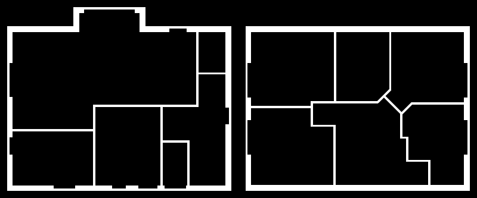

## Floorplan

The provided floorplan is just an example which you should replace with your own:

Use an image editor like [paint.net](http://www.getpaint.net/index.html) to create your own individual floorplan.
The image size is not fixed, but remember that you have to specify it (in pixels) in the module configuration.
